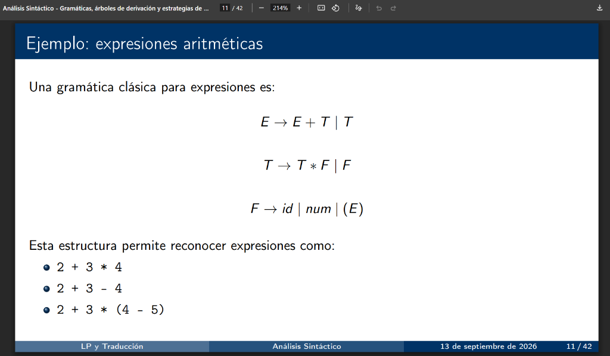
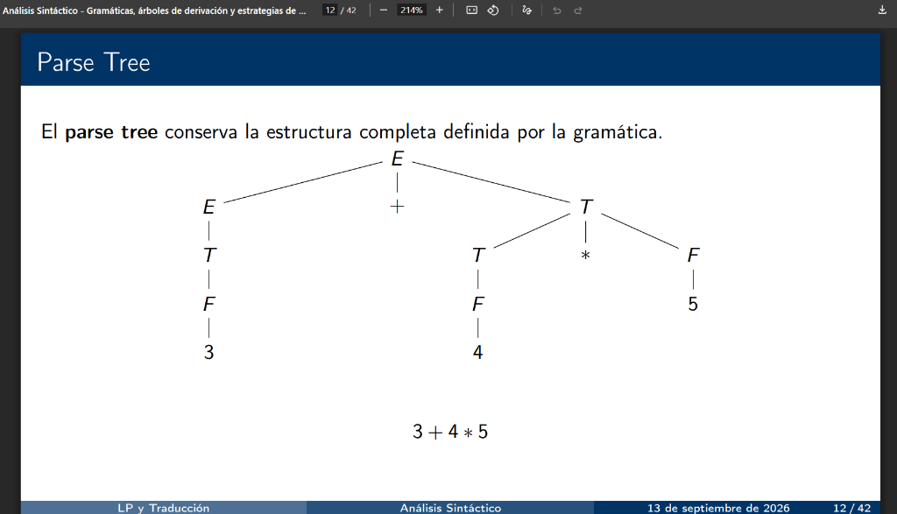
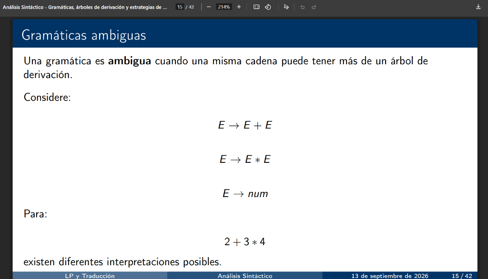

# Tarea Análisis Sintáctico | Lenguajes de Programación

## Información del Proyecto
- **Asignatura:** Lenguajes de Programación
- **Programa:** Ciencias de la Computación e Inteligencia Artificial
- **Institución:** Universidad Sergio Arboleda
- **Docente:** Joaquin F. Sanchez
- **Grupo:** 5
- **Autores:**
  - **Andrés Sebastián Coral Vallejo**
  - **Carol Arenas Cardona**

---

## Tabla de Contenidos
1. [Descripción General](#descripción-general)
2. [Estructura del Repositorio](#estructura-del-repositorio)
3. [Requisitos y Configuración del Entorno](#requisitos-y-configuración-del-entorno)
4. [Punto 1: Gramática de la Diapositiva 11 (ANTLR 4 + Python)](#punto-1-gramática-de-la-diapositiva-11-antlr-4--python)
5. [Punto 2: Comprobación de Formas de AST - Diapositiva 12](#punto-2-comprobación-de-formas-de-ast---diapositiva-12)
6. [Punto 3: Gramática Ambigua y Pruebas - Diapositiva 15](#punto-3-gramática-ambigua-y-pruebas---diapositiva-15)
7. [Guía de Ejecución de Pruebas](#guía-de-ejecución-de-pruebas)

---

## Descripción General

El presente proyecto implementa y analiza los conceptos fundamentales de **Análisis Sintáctico**, **Árboles de Derivación (Parse Trees / CST)**, **Árboles de Sintaxis Abstracta (AST)** y **Ambigüedad Gramatical**, desarrollados a partir de las diapositivas de clase (11/42, 12/42 y 15/42) utilizando **ANTLR 4** con lenguaje de destino **Python 3**.

---

## Estructura del Repositorio

```text
Tarea-Analisis-Sintactico-Lenguajes-de-Programacion/
├── README.md                                # Documentación técnica y académica completa
├── requirements.txt                         # Dependencias de Python (antlr4-python3-runtime)
├── main.py                                  # Ejecutor central unificado de pruebas
├── docs/
│   └── img/                                 # Capturas de las diapositivas 11, 12 y 15
│       ├── diapositiva_11.png
│       ├── diapositiva_12.png
│       └── diapositiva_15.png
├── diapositiva_11/                          # Punto 1: Expresiones aritméticas clásicas
│   ├── ArithmeticExpr.g4                    # Gramática formal en ANTLR 4
│   ├── ArithmeticExprLexer.py               # Lexer generado
│   ├── ArithmeticExprParser.py              # Parser generado
│   ├── ArithmeticExprVisitor.py             # Visitor generado
│   ├── evaluator.py                         # Evaluador semántico con soporte para variables
│   ├── tree_printer.py                      # Visualizador ASCII/Unicode del Parse Tree
│   ├── error_listener.py                    # Captura y diagnóstico de errores sintácticos
│   ├── compilar.bat                         # Script de compilación de la gramática
│   ├── test_diapositiva_11.py               # Suite de pruebas automatizadas
│   └── inputs/                              # Archivos de entrada para pruebas
├── diapositiva_12/                          # Punto 2: Comparación CST vs Formas de AST
│   ├── ast_nodes.py                         # Jerarquía de clases para modelar ASTs
│   ├── ast_builder.py                       # Transformador CST -> AST usando Visitor
│   ├── test_diapositiva_12.py               # Generación y comprobación de las 5 formas de AST
│   └── evidencia_formas_ast.txt             # Reporte comparativo de resultados
└── diapositiva_15/                          # Punto 3: Análisis y pruebas de ambigüedad
    ├── AmbiguousExpr.g4                     # Gramática ambigua (+ antes de *)
    ├── AmbiguousExprReversed.g4             # Gramática ambigua invertida (* antes de +)
    ├── evaluator_ambiguous.py               # Evaluadores para ambas gramáticas
    ├── compilar.bat                         # Compilación de gramáticas ambiguas
    ├── test_ambiguedad.py                   # Pruebas empíricas y demostración formal
    └── evidencia_ambiguedad.txt             # Reporte de resultados de ambigüedad
```

---

## Requisitos y Configuración del Entorno

- **Python:** 3.10 o superior (verificado con Python 3.14).
- **ANTLR 4:** runtime de Python `antlr4-python3-runtime` versión 4.13.2.
- **Herramienta generadora (opcional si se desea recompilar):** `antlr4-tools` o `antlr4`.

Instalación de dependencias:
```bash
pip install -r requirements.txt
```

---

## Punto 1: Gramática de la Diapositiva 11 (ANTLR 4 + Python)



### Gramática Teórica
La diapositiva 11 presenta la gramática clásica para expresiones aritméticas:
$$E \to E + T \mid T$$
$$T \to T * F \mid F$$
$$F \to \text{id} \mid \text{num} \mid ( E )$$

Esta estructura estratificada resuelve dos problemas fundamentales:
1. **Precedencia:** El operador $*$ ($T$) se evalúa a un nivel más profundo en el árbol que $+$, otorgándole mayor prioridad.
2. **Asociatividad:** La recursión por la izquierda ($E \to E + T$) garantiza que los operadores se agrupen de izquierda a derecha.

Para abarcar los ejemplos citados en la misma diapositiva (`2 + 3 - 4` y `2 + 3 * (4 - 5)`), la gramática fue extendida naturalmente con resta ($-$) y división ($/$).

### Definición en ANTLR 4 (`ArithmeticExpr.g4`)
```antlr
grammar ArithmeticExpr;

program
    : expr EOF
    ;

expr
    : expr '+' term     # Add
    | expr '-' term     # Sub
    | term              # ToTerm
    ;

term
    : term '*' factor   # Mul
    | term '/' factor   # Div
    | factor            # ToFactor
    ;

factor
    : ID                # IdFactor
    | NUM               # NumFactor
    | '(' expr ')'      # ParenFactor
    ;

ID  : [a-zA-Z_][a-zA-Z0-9_]* ;
NUM : [0-9]+ ('.' [0-9]+)? ;
WS  : [ \t\r\n]+ -> skip ;
```

### Resultados de las Pruebas
Se ejecutó la suite `test_diapositiva_11.py` cubriendo:
- **Casos de la diapositiva:**
  - `2 + 3 * 4` $\to$ Resultado: **14** (Respeta precedencia de $*$ sobre $+$).
  - `2 + 3 - 4` $\to$ Resultado: **1** (Asociatividad por la izquierda: $(2 + 3) - 4$).
  - `2 + 3 * (4 - 5)` $\to$ Resultado: **-1** (Los paréntesis alteran la precedencia natural).
- **Casos con identificadores (variables):**
  - `x + y * z` con $\{x: 10, y: 5, z: 2\} \to 20$.
  - `(x + y) * z` con $\{x: 10, y: 5, z: 2\} \to 30$.
- **Detección de errores sintácticos:**
  - `2 + * 3` $\to$ Rechazado: operador consecutivo inválido.
  - `(2 + 3` $\to$ Rechazado: paréntesis sin cerrar.
  - `+ 5` $\to$ Rechazado: falta operando izquierdo.
  - `2 3` $\to$ Rechazado: falta operador.

---

## Punto 2: Comprobación de Formas de AST - Diapositiva 12



La diapositiva 12 expone el **Parse Tree (CST)** para la expresión `3 + 4 * 5`:
```text
            E
        /   |   \
       E    +    T
       |       / | \
       T      T  *  F
       |      |     |
       F      F     5
       |      |
       3      4
```

### Diferencia Fundamental: Parse Tree (CST) vs AST
- **Parse Tree (Árbol Sintáctico Concreto - CST):** Refleja fielmente cada producción de la gramática formal. Contiene símbolos no terminales redundantes ($E \to T \to F \to 3$), operadores como hojas intermedias y nodos de puntuación. Para `3 + 4 * 5`, requiere **15 nodos**.
- **AST (Árbol de Sintaxis Abstracta):** Elimina el "ruido sintáctico". Los operadores se sitúan como nodos internos de control y los operandos como hojas. Para `3 + 4 * 5`, requiere únicamente **5 nodos** (reducción del **66.7%** en complejidad estructural).

### Las 5 Formas de AST Comprobadas
Implementadas en `ast_nodes.py` y `test_diapositiva_12.py`:

#### 1. Forma Jerárquica Orientada a Objetos (POPO / Clases en Python)
Nodos polimórficos de clases `BinaryOpNode` y `NumNode`:
```text
└── Op(+)
    ├── Num(3)
    └── Op(*)
        ├── Num(4)
        └── Num(5)
```
- **Total de nodos:** 5 nodos.
- **Evaluación semántica:** 23.

#### 2. Forma en Notación Prefija / S-Expressions y Tuplas Funcionales
Formato clásico de lenguajes como Lisp, Scheme y compiladores funcionales:
- **S-Expression:** `(+ 3 (* 4 5))`
- **Tuplas anidadas en Python:** `('+', 3, ('*', 4, 5))`

#### 3. Forma en Diccionario Estructurado / JSON (Estándar ESTree)
Estructura serializable empleada en linters modernos, analizadores estáticos y transpilers (Babel, ESLint):
```json
{
  "type": "BinaryExpression",
  "operator": "+",
  "left": {
    "type": "Literal",
    "value": 3
  },
  "right": {
    "type": "BinaryExpression",
    "operator": "*",
    "left": {
      "type": "Literal",
      "value": 4
    },
    "right": {
      "type": "Literal",
      "value": 5
    }
  }
}
```

#### 4. Forma N-Aria / Compactada (Flattened Multi-Op AST)
En operaciones asociativas homogéneas encadenadas (por ejemplo `1 + 2 + 3 + 4`), en lugar de crear múltiples niveles binarios a la izquierda, se aplanan en un único nodo multi-operando:
- **S-Expression N-Aria:** `(+ 1 2 3 4)`
- **Árbol N-Ario:**
```text
└── NaryOp(+)
    ├── Num(1)
    ├── Num(2)
    ├── Num(3)
    └── Num(4)
```

#### 5. Forma Nativa del Compilador de Python (`ast.parse`)
Estructura AST interna generada por CPython para la misma expresión:
```python
Expression(
  body=BinOp(
    left=Constant(value=3),
    op=Add(),
    right=BinOp(
      left=Constant(value=4),
      op=Mult(),
      right=Constant(value=5))))
```

---

## Punto 3: Gramática Ambigua y Pruebas - Diapositiva 15



La diapositiva 15 presenta la siguiente gramática:
$$E \to E + E$$
$$E \to E * E$$
$$E \to \text{num}$$
Para la cadena `2 + 3 * 4`.

### 1. Demostración Teórica Formal de Ambigüedad
Una gramática es ambigua si para al menos una cadena existen **dos o más árboles de derivación distintos** (o dos derivaciones más a la izquierda distintas):

- **Derivación A (Prioridad a la Suma / Multiplicación en la raíz):**
  $$E \Rightarrow E * E \Rightarrow (E + E) * E \Rightarrow (2 + 3) * 4 = \mathbf{20}$$
- **Derivación B (Prioridad a la Multiplicación / Suma en la raíz):**
  $$E \Rightarrow E + E \Rightarrow 2 + (E * E) \Rightarrow 2 + (3 * 4) = \mathbf{14}$$

Al existir dos árboles válidos con resultados semánticos incompatibles ($20 \neq 14$), **la gramática es formalmente ambigua**.

### 2. Implementación en ANTLR 4 y Comprobación Empírica
¿Cómo reacciona ANTLR 4 ante esta gramática ambigua?
ANTLR 4 soporta recursión izquierda directa, pero desambigua determinísticamente utilizando **la regla de precedencia por orden de alternativas**: la primera alternativa listada en la regla tiene mayor prioridad.

Se crearon dos gramáticas para comprobarlo empíricamente:

1. **`AmbiguousExpr.g4` (Regla `+` antes de `*`):**
   ```antlr
   expr : expr '+' expr | expr '*' expr | NUM ;
   ```
   - **Árbol ANTLR:** `((2 + 3) * 4)`
   - **Resultado evaluado:** **20**
   - ANTLR favorece la suma por estar escrita primero, invirtiendo la matemática tradicional.

2. **`AmbiguousExprReversed.g4` (Regla `*` antes de `+`):**
   ```antlr
   expr : expr '*' expr | expr '+' expr | NUM ;
   ```
   - **Árbol ANTLR:** `(2 + (3 * 4))`
   - **Resultado evaluado:** **14**
   - Al invertir el orden físico de las líneas en el código de la gramática, el árbol cambia radicalmente para la misma cadena de entrada.

### Cuadro Comparativo de Ambigüedad

| Configuración / Modelo | Árbol / Agrupación Generada | Valor Evaluado | ¿Es Ambigua la Gramática? |
|---|---|---|---|
| **Teoría Formal: Derivación A** | `((2 + 3) * 4)` | 20 | **SÍ** (Árbol 1) |
| **Teoría Formal: Derivación B** | `(2 + (3 * 4))` | 14 | **SÍ** (Árbol 2) |
| **ANTLR: `AmbiguousExpr` (`+` primero)** | `((2 + 3) * 4)` | 20 | **SÍ** (Sesgo por orden de regla) |
| **ANTLR: `AmbiguousExprReversed` (`*` primero)** | `(2 + (3 * 4))` | 14 | **SÍ** (Sesgo por orden de regla) |
| **Diapositiva 11 (Gramática no ambigua $E, T, F$)** | `(2 + (3 * 4))` | 14 | **NO** (Estratificada estructuralmente) |

---

## Guía de Ejecución de Pruebas

Para ejecutar todos los entregables de manera automatizada:
```bash
python main.py
```

Para ejecutar cada módulo de forma individual:
```bash
# Probar Punto 1 (Diapositiva 11)
python main.py 11
# o directamente:
python diapositiva_11/test_diapositiva_11.py

# Probar Punto 2 (Diapositiva 12 - Formas de AST)
python main.py 12
# o directamente:
python diapositiva_12/test_diapositiva_12.py

# Probar Punto 3 (Diapositiva 15 - Ambigüedad)
python main.py 15
# o directamente:
python diapositiva_15/test_ambiguedad.py
```

---
**Grupo 5 - Lenguajes de Programación**  
*Andrés Sebastián Coral Vallejo & Carol Arenas Cardona*
